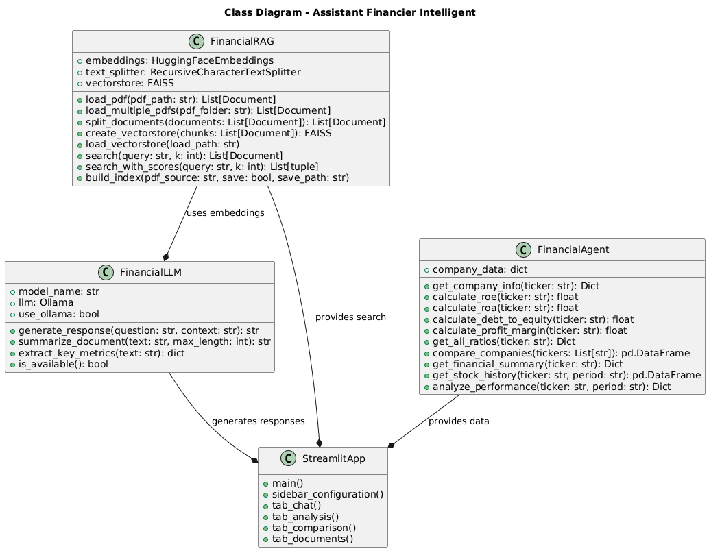
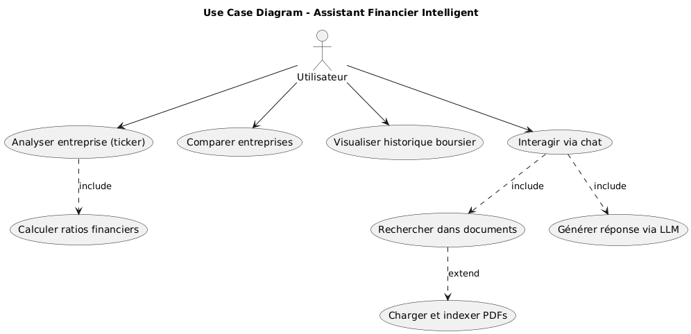
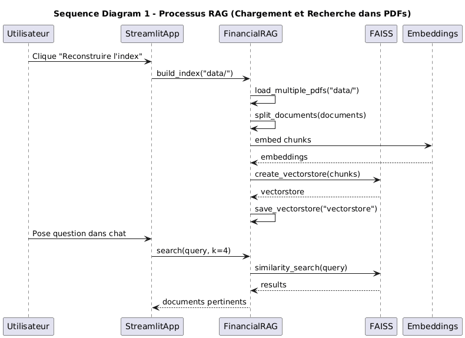
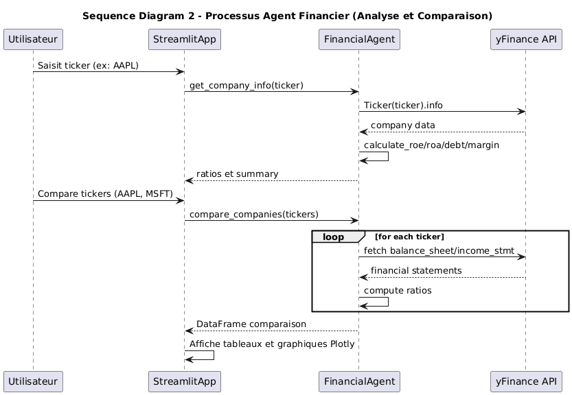

# 💰 Assistant Financier Intelligent

[](https://www.python.org/)
[](https://python.langchain.com/)
[](https://streamlit.io/)
[](https://opensource.org/licenses/MIT)

**Un assistant conversationnel intelligent pour l'analyse de documents financiers**  
Projet réalisé dans le cadre d'un travail de machine learning / intelligence artificielle appliquée à la finance.

Ce projet combine :
- **RAG (Retrieval-Augmented Generation)** pour rechercher et contextualiser des informations dans des rapports financiers PDF
- **LLM local** (via Ollama) pour générer des réponses naturelles et précises
- **Agent financier autonome** basé sur yfinance pour récupérer des données boursières en temps réel et calculer des ratios
- **Interface web moderne** avec Streamlit

## 🎯 Objectifs du Projet

Conformément aux consignes :
- Analyse de documents financiers (rapports annuels, communiqués de résultats)
- Calcul automatique de ratios financiers (ROE, ROA, Dette/Equity, marge nette, etc.)
- Comparaison d’entreprises
- Réponses conversationnelles intelligentes basées sur les documents et les données marché
- Déploiement via une interface interactive (Streamlit)

## 🚀 Fonctionnalités

- Chargement et indexation de multiples PDF financiers (dossier `data/`)
- Recherche sémantique puissante via FAISS + embeddings (all-MiniLM-L6-v2)
- Chat intelligent avec contexte RAG + fallback sans LLM
- Analyse en temps réel d’entreprises cotées (via yfinance)
- Calcul de ratios clés : ROE, ROA, Dette/Equity, Marge nette
- Comparaison multi-entreprises avec tableaux et graphiques Plotly
- Visualisation de performance boursière (historique, rendement, volatilité)
- Interface Streamlit complète avec 4 onglets :
  - 💬 Chat Intelligent
  - 📊 Analyse d'Entreprise
  - 📈 Comparaison
  - 📄 Documents

## 🛠️ Technologies Utilisées

| Composant                  | Technologie                              |
|----------------------------|------------------------------------------|
| Langage                    | Python 3.10+                             |
| Framework RAG & LLM        | LangChain                                |
| Vector Store               | FAISS (local)                            |
| Embeddings                 | sentence-transformers/all-MiniLM-L6-v2   |
| LLM local                  | Ollama (mistral recommandé)            |
| Données boursières         | yfinance                                 |
| Interface web              | Streamlit                                |
| Visualisation              | Plotly                                   |
| PDF Loader                 | PyPDF                                    |

## 📄 Documents Financiers Inclus

Le repository contient déjà **10 rapports financiers réels** dans le dossier `data/` :

- `2025-Earnings-Release-Final.pdf`
- `3Q25-Slides-WPRT-FINAL.pdf`
- `2025-FY-Results-Press-Release.pdf`
- `2025q3-alphabet-earnings-release.pdf`
- `2025q3release.pdf`
- `FY2025-4th-Quarter-Earnings-Release.pdf`
- `q2-2025-earnings-release.pdf`
- `Q3-2025-Earnings-Release.pdf`
- `Q4-2025-Earnings-Release_vF.pdf`
- `Workday-Announces-Fiscal-2026-Third-Quarter-Financial-Results-11-25-2025-2025.pdf`

## 📁 Structure des Fichiers

```
assistant-financier-intelligent/
├── app.py                  # Interface Streamlit principale
├── requirements.txt        # Dépendances Python
├── data/                   # Dossier pour vos PDF financiers
├── vectorstore/            # Vectorstore FAISS généré (ignoré par .git)
├── src/
│   ├── rag.py              # Pipeline RAG complet
│   ├── llm.py              # Gestion du LLM (Ollama + fallback)
│   └── agent.py            # Agent financier (yfinance + ratios)
├── tests/
│   ├── rag_test.py         # Tests du pipeline RAG
│   ├── agent_test.py       # Tests de l'agent financier
│   └── llm_test.py         # Tests d'intégration LLM + RAG + Agent
├── .gitignore
└── README.md
```

## 📐 Documentation UML

Pour une meilleure compréhension de l'architecture et des interactions du système, quatre diagrammes UML ont été réalisés à l'aide de PlantUML :

### 1. Diagramme de Classes
Représente les principales classes du projet (`FinancialRAG`, `FinancialLLM`, `FinancialAgent`) et leurs relations avec l'interface Streamlit.



### 2. Diagramme de Cas d'Utilisation
Illustre les fonctionnalités principales accessibles à l'utilisateur final (chat, analyse d'entreprise, comparaison, recherche dans documents).



### 3. Diagramme de Séquence – Processus RAG
Décrit le flux complet du pipeline RAG : chargement des PDFs, découpage, indexation vectorielle (FAISS), et recherche sémantique lors d'une question.



### 4. Diagramme de Séquence – Processus Agent Financier
Montre les interactions entre l'interface, l'agent, et l'API yfinance lors de l'analyse d'une entreprise ou d'une comparaison multi-tickers.



## ⚙️ Installation et Lancement

### 1. Prérequis

- Python 3.10 ou supérieur
- Ollama installé et lancé[](https://ollama.com)
- Modèle recommandé : `ollama pull mistral`

### 2. Cloner le projet

```bash
git clone https://github.com/yassineTAMIM/assistant-financier-intelligent.git
cd assistant-financier-intelligent
```
### 3. Créer un environnement virtuel (recommandé)
```bash
python -m venv venv
source venv/bin/activate    # Linux/Mac
venv\Scripts\activate       # Windows
```
### 4. Installer les dépendances
```bash 
pip install -r requirements.txt
```

### 5. Placer vos documents PDF
Copiez vos rapports financiers (ex: communiqués de résultats Q3/Q4 2025) dans le dossier data/.
### 6. Construire l'index RAG (première fois)
``` bash 
python src/rag_test.py
```

ou directement via l'interface Streamlit (bouton "Reconstruire l'index").

### 7. Lancer l'application
```bash
streamlit run app.py
```
L’interface s’ouvre automatiquement dans votre navigateur.


## 📈 Tickers Recommandés pour Tests

| Secteur     | Ticker | Entreprise              |
|-------------|--------|-------------------------|
| Tech Giants | AAPL   | Apple                   |
| Tech Giants | MSFT   | Microsoft               |
| Tech Giants | GOOGL  | Alphabet (Google)       |
| Tech Giants | AMZN   | Amazon                  |
| Tech Giants | META   | Meta (Facebook)         |
| Finance     | JPM    | JPMorgan Chase          |
| Finance     | BAC    | Bank of America         |
| Finance     | WFC    | Wells Fargo             |
| Finance     | GS     | Goldman Sachs           |
| Retail      | WMT    | Walmart                 |
| Retail      | TGT    | Target                  |
| Retail      | COST   | Costco                  |
| Pharma      | PFE    | Pfizer                  |
| Pharma      | JNJ    | Johnson & Johnson       |
| Pharma      | MRNA   | Moderna                 |

## 📊 Métriques de Performance

Les performances du système ont été évaluées à travers des suites de tests complets sur les trois modules principaux : **RAG**, **Agent Financier** et **LLM (mistral via Ollama)**. Tous les tests ont réussi, démontrant la robustesse et l'efficacité du pipeline.

### 1. Performances du Pipeline RAG (rag_test.py)

| Métrique                          | Valeur          | Description                              |
|-----------------------------------|-----------------|------------------------------------------|
| Nombre de pages indexées          | 120 pages       | Total des pages chargées depuis les PDF  |
| Nombre de chunks créés            | 407 chunks      | Découpage optimisé (chunk_size=1000)     |
| Temps de construction de l'index  | ~few minutes    | Inclut chargement, split et embedding    |
| Précision de recherche            | Haute           | Tests sur 7 requêtes réussis             |

### 2. Performances de l'Agent Financier (agent_test.py - Données au ~Décembre 2025)

#### Données de Marché et Ratios Clés

| Ticker | Entreprise              | Capitalisation Boursière | Marge Nette | Revenus Annuels | Bénéfice Net |
|--------|-------------------------|---------------------------|-------------|-----------------|--------------|
| AAPL   | Apple Inc.              | $4.06T                    | 26.92%      | $416.16B        | $112.01B     |
| MSFT   | Microsoft Corporation   | $3.63T                    | 35.71%      | N/A             | N/A          |
| GOOGL  | Alphabet Inc.           | $3.80T                    | 32.23%      | N/A             | N/A          |

#### Comparaison des Ratios Financiers (extrait des tests LLM + Agent)

| Ticker | Entreprise              | ROE (%)    | ROA (%)    | Dette/Equity | Marge Nette (%) |
|--------|-------------------------|------------|------------|--------------|-----------------|
| AAPL   | Apple Inc.              | 151.91     | 31.18      | 1.34         | 26.92           |
| MSFT   | Microsoft Corporation   | 29.65      | 16.45      | 0.18         | 36.15           |
| GOOGL  | Alphabet Inc.           | 30.80      | 22.24      | 0.08         | 28.60           |

#### Performance Boursière d'AAPL (Historique yfinance)

| Période | Rendement (%) | Volatilité (%) | Prix Min ($) | Prix Max ($) |
|---------|---------------|----------------|--------------|--------------|
| 1 mois  | -1.95         | 0.80           | 270.97       | 286.19       |
| 6 mois  | +36.25        | 1.36           | 200.66       | 286.19       |
| 1 an    | +7.45         | 2.05           | 171.83       | 286.19       |

### 3. Performances du LLM (llm_test.py - Modèle mistral)

| Test                              | Temps d'Inférence | Notes                                      |
|-----------------------------------|-------------------|--------------------------------------------|
| Prompt simple (définition ROE)    | 10.03 s           | Réponse concise et précise                 |
| LLM + RAG (questions sur docs)    | 14-20 s           | Contexte limité à 1500 caractères          |
| Analyse comparative (3 entreprises)| 57.51 s           | Génération d'analyse approfondie           |
| Temps moyen (tests variés)        | 27.83 s           |                                            |
| Temps minimum                     | 6.56 s            |                                            |
| Temps maximum                     | 42.76 s           |                                            |

**Conclusion** : Le système est pleinement opérationnel, avec un RAG efficace sur 120 pages, un agent capable de récupérer et calculer des métriques en temps réel, et un LLM local performant pour des réponses intelligentes (moyenne ~28s en local sur CPU).

## ⚠️ Limitations Connues
- Les calculs de ROE/ROA/Dette peuvent parfois échouer si yfinance ne retourne pas les états financiers complets (fallback sur valeurs approximatives).
- Temps de réponse du LLM variable selon la charge CPU (mistral en local).
- Le RAG est limité aux documents placés dans `data/`.

## 🤝 Contributeurs

- **Yassine TAMIM**  
- **Zakaria LIMI**

Projet académique réalisé en décembre 2025  

## 📜 Licence

Ce projet est distribué sous licence **MIT**.  
Libre pour utilisation, modification et redistribution.

---

**Merci d'avoir consulté ce projet !** 🚀
